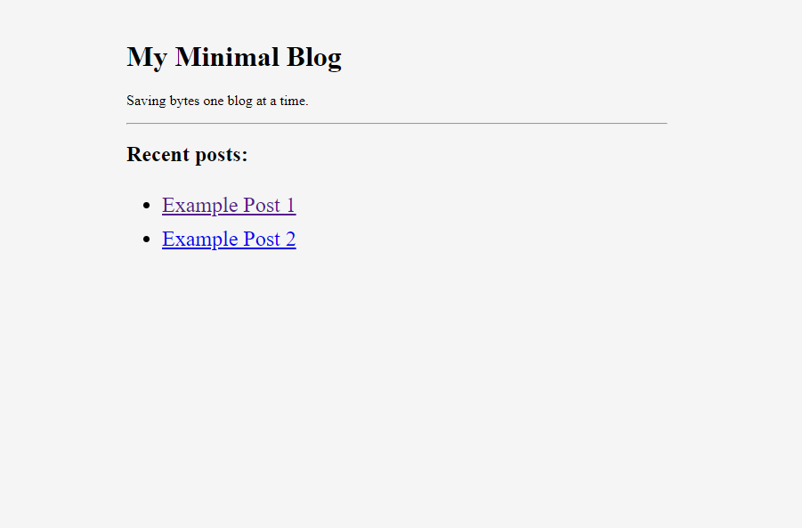
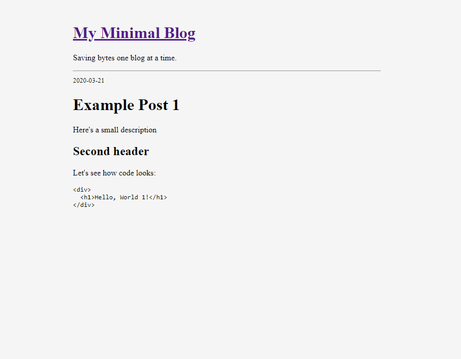

# Minimal Static Blog Generator in Python
Simple static blog generator, written in Python, with the top Lighthouse scores.

_Missing 'Best Practices' and 'SEO' due to server-side configuration._

## Screenshots

## Usage
1. Add posts to `posts/`
2. Run: `python generate_static_blog.py`
3. See results in `public/blog/`

Optional, here's an easy way to deploy to a server (assuming you have npm installed):
1. Run: `npx surge public/blog my-blog.surge.sh`
Note: You will need to change the sub-domain of the '*.surge.sh' URL

## Improvement ideas
- Rather than a using a custom parser for the front matter, use `pip install fronmatter`
- Potentially use extensions for the markdown library: https://python-markdown.github.io/extensions/
